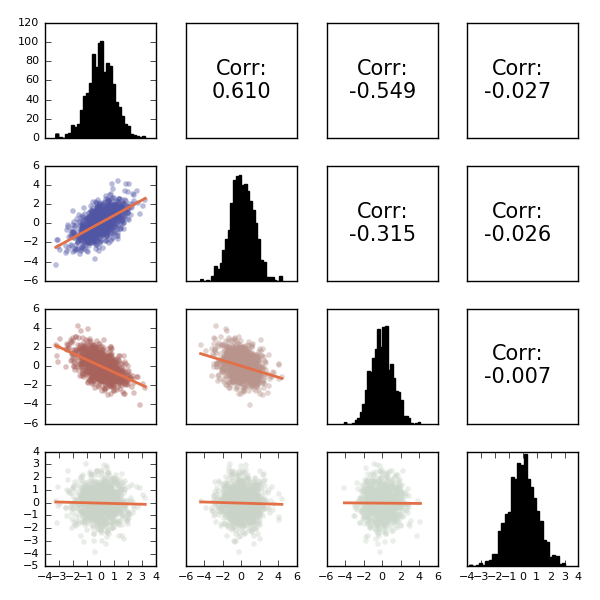

# MLPlots

[](https://travis-ci.org/tbreloff/MLPlots.jl)

WIP: Common plotting recipes for statistics and machine learning.

This package uses [Plots.jl](https://github.com/tbreloff/Plots.jl) to provide high-level statistical plotting
tools which are independent of both the platform and graphical library.

A simple example:

```
# load Plots and MLPlots
using MLPlots

# some random data
M = randn(1000, 4)
M[:,2] += 0.8M[:,1]
M[:,3] -= 0.7M[:,1]

# show a correlation grid
corrplot(M, size=(700,700))

# save the image
png("docs/corrplot_example")
```




See the issues for a TODO list.  Collaboration is very welcome.
