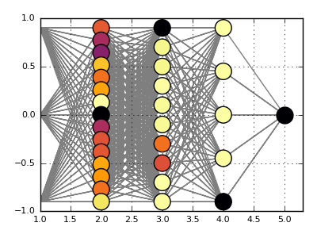
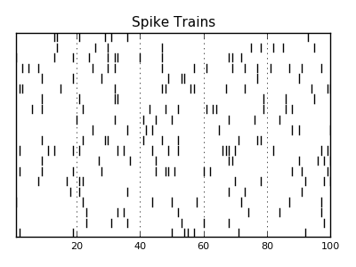
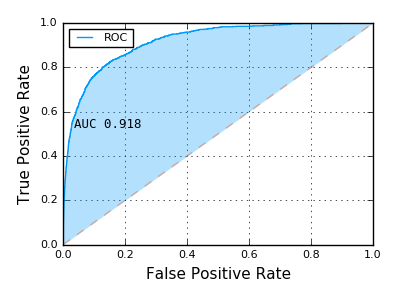

# MLPlots

[](https://travis-ci.org/JuliaML/MLPlots.jl)

Common plotting recipes for statistics and machine learning.

This package uses [RecipesBase](https://github.com/JuliaPlots/RecipesBase.jl) to provide mappings from types defined in
statistics and machine learning packages to generic descriptions of visualization attributes and data.  These recipes can then be used in
conjunction with [Plots.jl](https://github.com/tbreloff/Plots.jl) to provide flexible statistical and machine learning
visualizations which are independent of both the platform and graphical library.

Many recipes are conditionally included and are loaded on the relevant `using` call of the library.
For example `using ROCAnalysis, MLPlots` will load plotting recipes for roc curves defined in ROCAnalysis.  Recipes include:

- [OnlineAI](#onlineai): Neural nets and spike trains
- [ROCAnalysis](#rocanalysis): ROC/AUC curves

#### Status: This package is currently on hiatus until further notice.  Collaboration is welcomed and encouraged!

## OnlineAI

Neural nets with [OnlineAI.jl](https://github.com/tbreloff/OnlineAI.jl).  Show the current state of a neural net:

```julia
using OnlineAI, MLPlots
net = buildClassificationNet(3, 1, [15,10,5])
plot(net)
```



For spiking neuron models, a spike (or raster) plot is useful to see firing times among neurons:

```julia
n = 20
spikes = SpikeTrains(n, title = "Spike Trains", color = :darkblue)
for t=1:100, i=1:n
    if rand() < 0.1
        push!(spikes, i, t)
    end
end
spikes.plt
```



## ROCAnalysis

[ROCAnalysis.jl](https://github.com/davidavdav/ROCAnalysis.jl)

```julia
using ROCAnalysis, MLPlots
curve = ROCAnalysis.roc(2+2randn(1000), -2+2randn(100000))
plot(curve)
```


