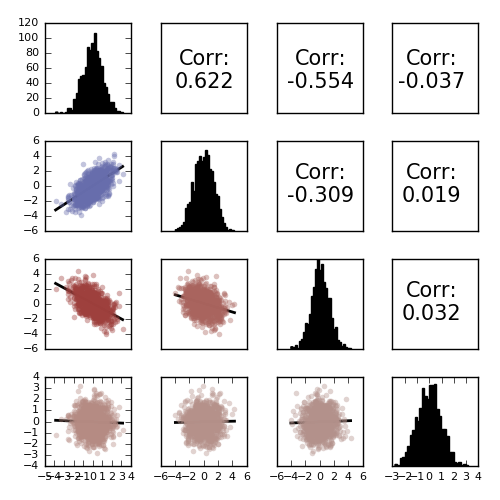

# MLPlots

[](https://travis-ci.org/JuliaML/MLPlots.jl)

WIP: Common plotting recipes for statistics and machine learning.

This package uses [Plots.jl](https://github.com/tbreloff/Plots.jl) to provide high-level statistical and machine learning plotting
recipes which are independent of both the platform and graphical library.

---

Correlation grids:

```julia
using MLPlots
M = randn(1000, 4)
M[:,2] += 0.8M[:,1]
M[:,3] -= 0.7M[:,1]
corrplot(M, size=(700,700))
```



---

Neural nets with OnlineAI:

```julia
using OnlineAI, MLPlots
net = buildClassificationNet(3, 1, [15,10,5])
plot(net)
```


---

ROC Analysis:

```julia
using ROCAnalysis, MLPlots
curve = ROCAnalysis.roc(2+2randn(1000), -2+2randn(100000))
plot(curve)
```


---

See the issues for a TODO list.  Collaboration is very welcome.
