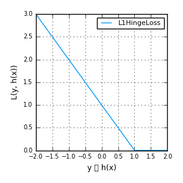
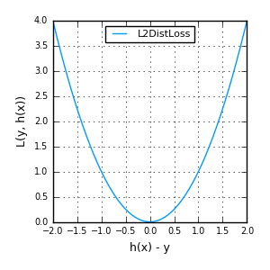
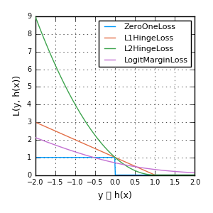
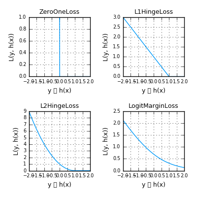
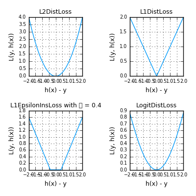
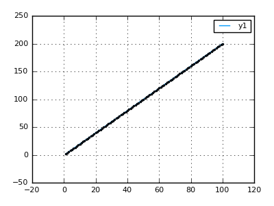
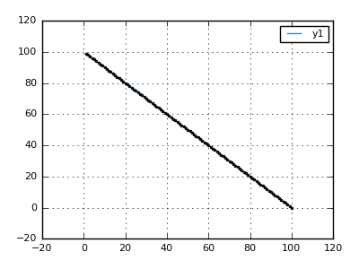

# MLPlots

[](https://travis-ci.org/JuliaML/MLPlots.jl)

Common plotting recipes for statistics and machine learning.

This package uses [Plots.jl](https://github.com/tbreloff/Plots.jl) to provide high-level statistical and machine learning plotting
recipes which are independent of both the platform and graphical library.

There are plotting recipes for external packages which are conditionally included and are loaded on the relevant `using` call.
For example `using LearnBase, MLPlots` will load plotting recipes for loss functions defined in LearnBase.  Recipes include:

- [LearnBase](#learnbase): Loss functions
- [Correlation grids](#correlation-grids): `corrplot`
- [OnlineAI](#onlineai): Neural nets and spike trains
- [ROCAnalysis](#rocanalysis): ROC/AUC curves
- [ValueHistories](#valuehistories): Tracked values over time

#### Status: This package is usable and tested, but needs more content.  Collaboration is welcomed and encouraged!

## LearnBase

[LearnBase.jl](https://github.com/Evizero/LearnBase.jl) provides a set of commonly used loss functions. Such functions do have a typical style of plotting depending on their category.

It is possible to plot both, Margin-based and Distance-based Lossfunctions by themselves

```julia
plot(LossFunctions.HingeLoss())
plot(LossFunctions.L2DistLoss())
```




Furthermore it is also supported to plot a group of Lossfunctions from the same category within one plot

```julia
plot([ZeroOneLoss(), L1HingeLoss(), L2HingeLoss(), LogitMarginLoss()])
plot([L2DistLoss(), L1DistLoss(), EpsilonInsLoss(.4), LogitDistLoss()])
```




If desired plotting a set of lossfunctions can also be done using subplots, as the following example shows

```julia
subplot([ZeroOneLoss(), L1HingeLoss(), L2HingeLoss(), LogitMarginLoss()], size=(400,400))
subplot([L2DistLoss(), L1DistLoss(), EpsilonInsLoss(.4), LogitDistLoss()], size=(400,400))
```




## Correlation grids:

```julia
using MLPlots
M = randn(1000, 4)
M[:,2] += 0.8M[:,1]
M[:,3] -= 0.7M[:,1]
corrplot(M, size=(700,700))
```


## OnlineAI

Neural nets with [OnlineAI.jl](https://github.com/tbreloff/OnlineAI.jl):

```julia
using OnlineAI, MLPlots
net = buildClassificationNet(3, 1, [15,10,5])
plot(net)
```


```julia
n = 20
spikes = SpikeTrains(n, title = "Spike Trains", color = :darkblue)
for t=1:100, i=1:n
    if rand() < 0.1
        push!(spikes, i, t)
    end
end
spikes.plt
```


## ROCAnalysis

[ROCAnalysis.jl](https://github.com/davidavdav/ROCAnalysis.jl)

```julia
using ROCAnalysis, MLPlots
curve = ROCAnalysis.roc(2+2randn(1000), -2+2randn(100000))
plot(curve)
```


## ValueHistories

The package [ValueHistories.jl](https://github.com/JuliaML/ValueHistories.jl) provides
different means to track one or more value of time.
To track multiple values over time one can use a `DynMultivalueHistory`. The tracked values
of a Numeric type (subtype of `Real`) can then be plotted like the following example shows

```julia
using ValueHistories, MLPlots
history = ValueHistories.DynMultivalueHistory()
for i=1:100
  x = 0.1i
  push!(history, :a, x, sin(x))
  push!(history, :wrongtype, x, "$(sin(x))")
  if i % 10 == 0
    push!(history, :b, x, cos(x))
  end
end
plot(history)
```


There are also two means to track single values a little bit more efficiently.

- `QueueUnivalueHistory`

```julia
using ValueHistories, MLPlots
history = ValueHistories.QueueUnivalueHistory(Int)
for i = 1:100
  push!(history, i, 2i)
end
plot(history)
```



- `VectorUnivalueHistory`

```julia
using ValueHistories, MLPlots
history = ValueHistories.VectorUnivalueHistory(Int)
for i = 1:100
  push!(history, i, 100-i)
end
plot(history)
```



